# AWS SES & Route 53 Configuration Guide

This document details the configuration of the Email Architecture for the **StudyFlow** project.
We moved the DNS management to AWS Route 53 to facilitate the integration with Amazon SES (Simple Email Service), enabling professional email delivery with authenticated domains (`polplana.work`).

**Region Note:** While our main infrastructure is in `eu-south-2` (Spain), SES is configured in **`eu-west-3` (Paris)** as it is the nearest available region for this service.

---

## Phase 1: Route 53 Hosted Zone Setup

We started by handing over control of the DNS from our registrar (Porkbun) to AWS.

### 1. Creating the Hosted Zone
We created a Public Hosted Zone in AWS Route 53 for `polplana.work`.

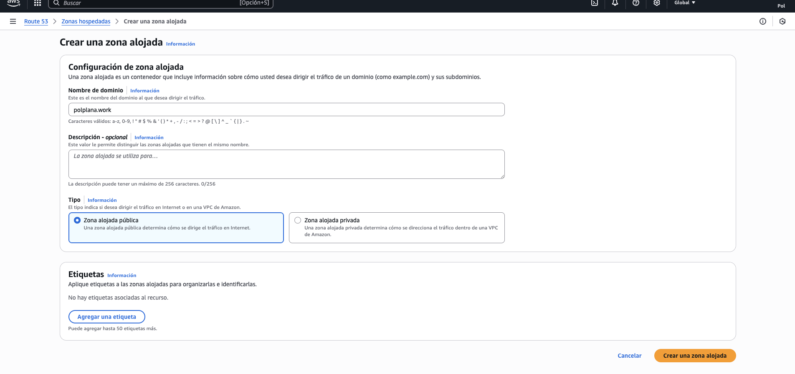

### 2. Initial State
Initially, the zone only contained the default records:
*   **NS (Name Servers):** The "security guards" of the domain.
*   **SOA (Start of Authority):** Technical administration record.

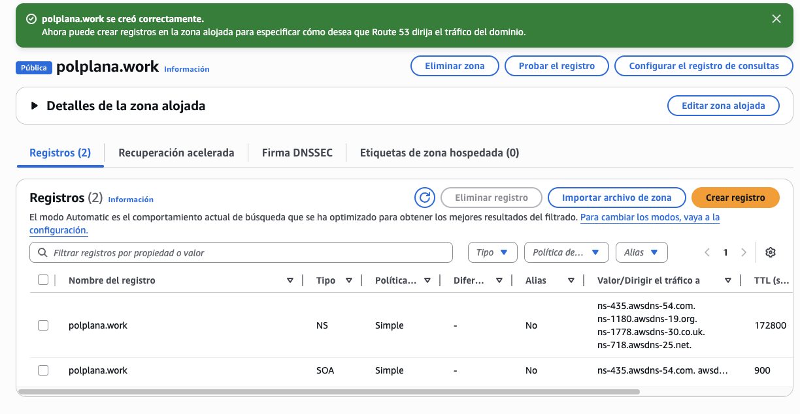

### 3. Pointing Registrar to AWS
We took the 4 NS addresses provided by AWS and updated the "Authoritative Nameservers" in Porkbun. This propagates the change so the internet knows AWS now manages our domain.

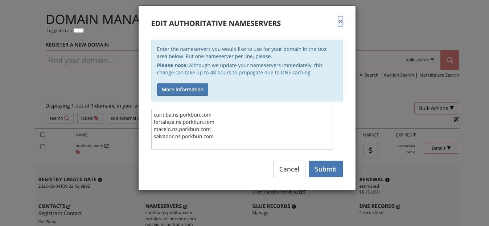

---

## Phase 2: SES Identity & DKIM Verification

To prevent our emails from landing in SPAM, we configured **DKIM (DomainKeys Identified Mail)**. This adds a cryptographic signature to every email.

### 1. Creating the Identity
In the SES Console (`eu-west-3`), we created a Domain Identity.
*   **Configuration:** Easy DKIM (RSA 2048-bit).
*   **Automation:** We enabled **"Publish DNS records to Route 53"**. This allows AWS to automatically write the necessary CNAME records to our DNS zone without manual copy-pasting.

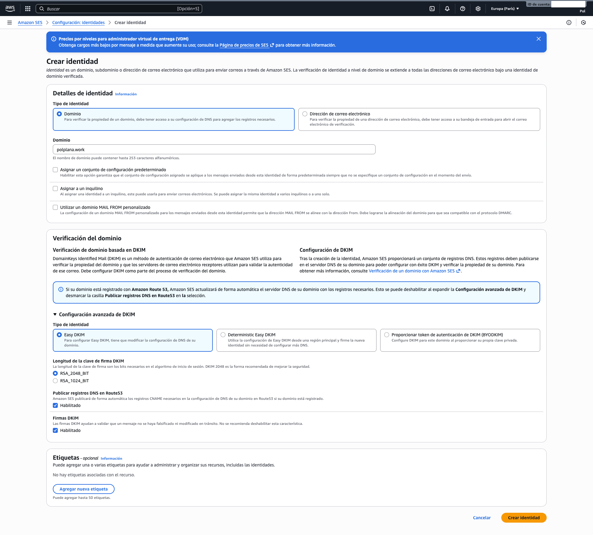

### 2. Result in Route 53
After creation, AWS automatically injected 3 CNAME records into our Hosted Zone. These serve as the "keys" for the DKIM signature verification.

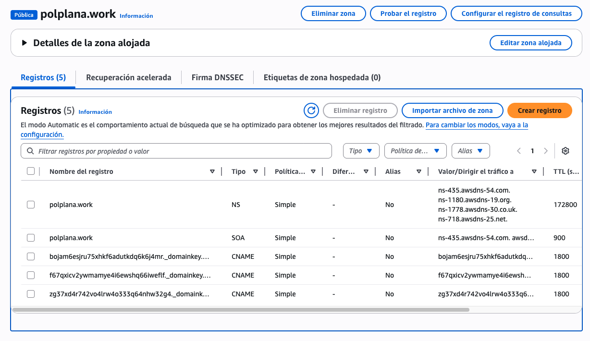

---

## Phase 3: Professional Deliverability (DMARC & Custom MAIL FROM)

To ensure high deliverability and professional appearance (removing the "sent by: eu-west-3.amazonses.com" tag in Gmail), we added advanced configurations. if you don't set up this, the email "from" address would still appear as our domain (polplana.work), but email clients might show "sent by amazonses.com", which looks less professional. The "from" and "mail from" are different headers in email protocols. While the "from" address is what users see, the "mail from" (or return-path) is used for handling bounces and is part of the email's technical routing information. Setting up a custom "mail from" domain is optional, as in AWS SES, emails can still be sent using the default "mail from" domain provided by Amazon.

### 1. DMARC Policy
We established a **DMARC** policy. This tells email providers (Gmail, Outlook) what to do if an email fails security checks.
*   **Policy:** `p=none` (Monitor mode). This ensures legitimate emails are not rejected while we test the system.
*   We clicked "Publish DNS records" to automatically add the default `_dmarc` TXT record.

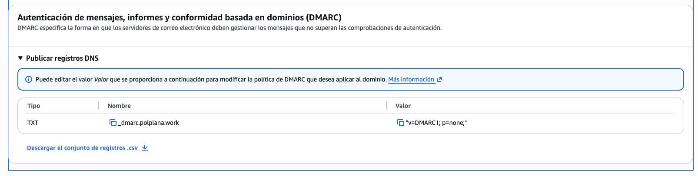

### 2. Custom MAIL FROM Domain
We configured a specific subdomain (`mail.polplana.work`) to handle the "Return-Path" of the emails. This aligns the sender domain with the mailing route.

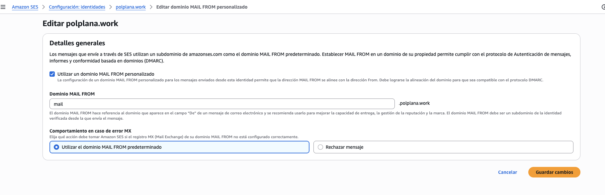

### 3. Publishing MX and SPF Records
SES required two new records to authorize `mail.polplana.work`:
1.  **MX Record:** Handles bounce backs (feedback loop).
2.  **TXT (SPF) Record:** Authorizes Amazon IPs to send email on our behalf.
We used the automatic publishing button to push these to Route 53.

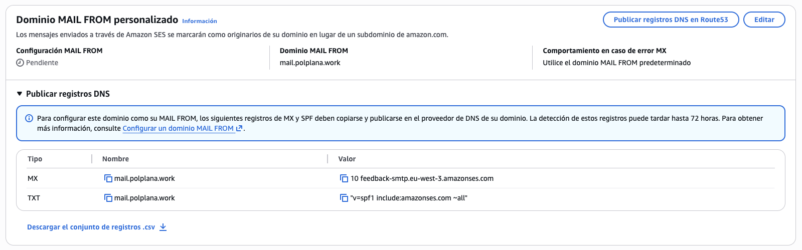

---

## Final Architecture Status

After completing all steps, our Route 53 Hosted Zone is fully populated with all security protocols:
1.  **NS & SOA:** Core DNS.
2.  **CNAME (x3):** DKIM Keys.
3.  **TXT:** DMARC Policy.
4.  **MX & TXT:** Custom MAIL FROM configuration.

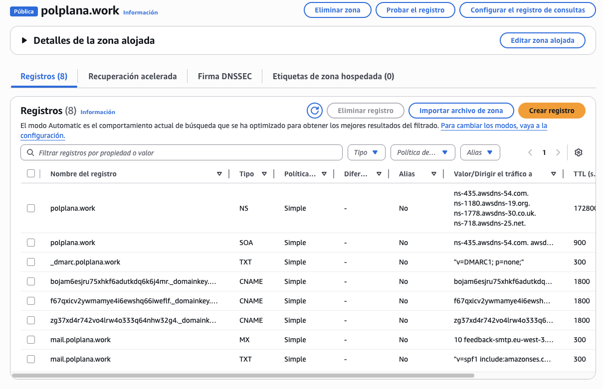

---

## Phase 4: Requesting Production Access (Sandbox Exit)

By default, new AWS accounts are placed in the **SES Sandbox**. This limits the account to 200 emails/24h and restricts sending only to verified email addresses (our own team). To enable the application to function properly for the demo, we had to request Production Access.

### 1. Initiating the Request
We accessed the "Account Dashboard" in the SES console and initiated the wizard to request production access.

### 2. Submitting Use Case Details
We filled out the request form specifying:
*   **Mail Type:** Transactional (strictly for application notifications, no marketing).
*   **Website URL:** We provided our domain (`polplana.work`), even when the website was not still deployed.

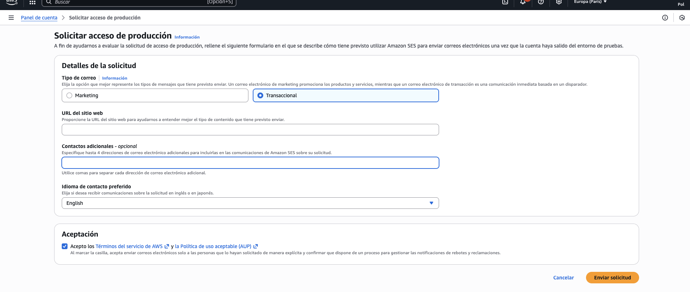

### 3. Support Verification Process
AWS Support opened a case to verify our intentions. They requested further details regarding how we handle bounces and list management to ensure we are not spammers. 

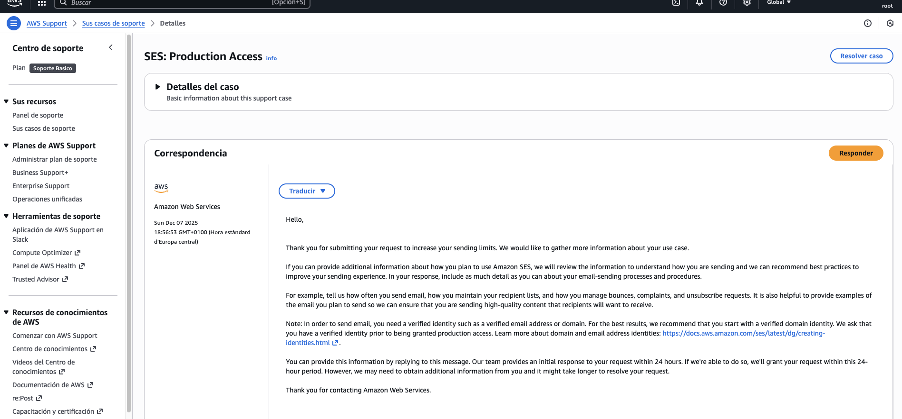

We replied with a structured response detailing we are students working on a Cloud course in the UPC:

### 4. Approval
AWS Trust & Safety team reviewed our justification and granted production access. Our sending quota was increased to **50,000 emails per day** and **14 emails per second**, and moving us outside of the SES Sandbox, allowing the *StudyFlow* application to operate without restrictions.

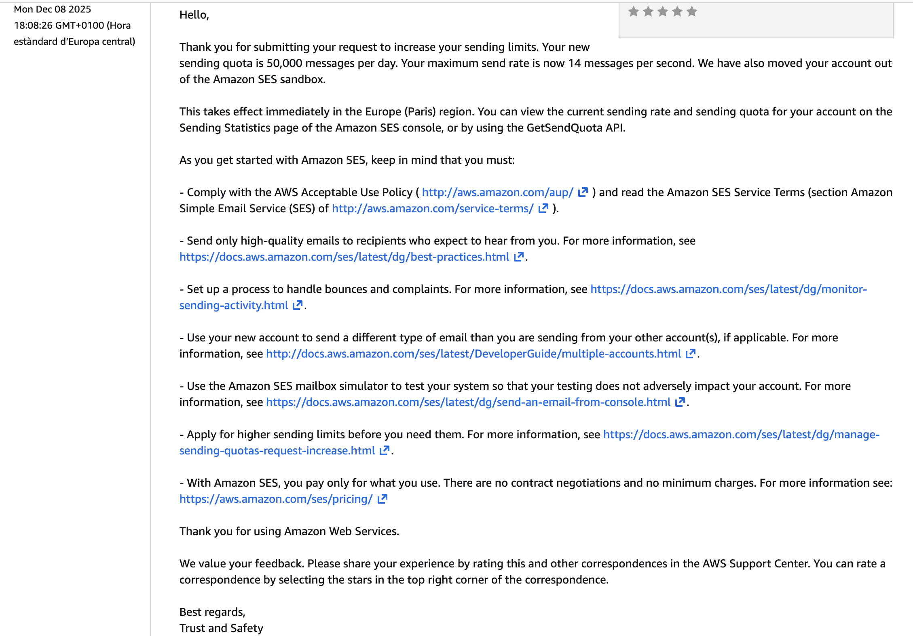
